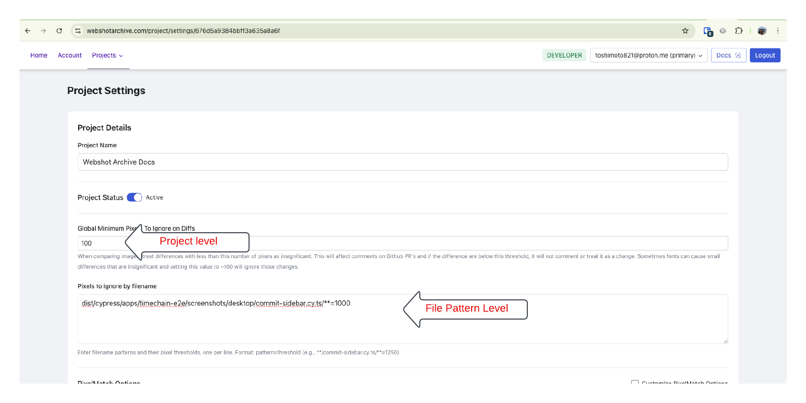

# Image Diffing

Understanding diffs are at the core of Webshot Archive. This blog post will explain how diffs work and where they are used.

## Diffs in Github Comments on PR

When the Webshot Archive Github Action runs, your screenshots are uploaded to our hosted storage. The server will then create a diff of the new screenshot and the screenshot the action tells it to compare to. This diff is then uploaded to the Webshot Archive storage along with the original screenshot and added to the Github comment on your PR.


## Diffs in Screenshot Comparison Carousel

You can also see the diff on the Screenshot Comparison Carousel. In this example the diff is almost `4000` pixels which is a lot but can give some context to what a little value might be. In my opinion `250` pixels is a good starting point. Some pages though may have a lot of noise and a higher value may be needed which can be done on an individual basis (details below).


<!-- truncate -->

## Minimum Pixels To Ignore

This value is the number of pixels that are different between the original screenshot and the comparison screenshot. This is the value returned by `pixelmatch()` as documented [here](https://github.com/mapbox/pixelmatch?tab=readme-ov-file#pixelmatch). If an image differs by just a few pixels because of noise such as font rendering this number will be low. [Here](https://github.com/webshotarchive/docs/pull/2) is an example with nearly `4000` pixel differents.

You can set the minimum pixels to ignore on the Project Settings page.


#### Global Minimum Pixels To Ignore on Diffs

Setting this value will set the value for all images you upload in this project. Any image differences that are less than this value will be treated as identical to the comparison image.

#### Pixels to ignore by filename

The file pattern a `<glob>=<number>`

```text
**/some-cool-test.cy.ts/**=1000
**/some-other-cool-test.cy.ts/**=2000
```

This will set the minimum pixels to ignore to `1000` for all screenshots in the `some-cool-test.cy.ts` file. and `2000` for all screenshots in the `some-other-cool-test.cy.ts` file.

:::tip
Use one line per file pattern and create as many rules as you need.

:::

Now when minor changes are done, the screenshots are treated as identical and no changes are documented. The benefit of Webshot Archive is to be able to clearly understand what and when <b>significant</b> changes are made.
