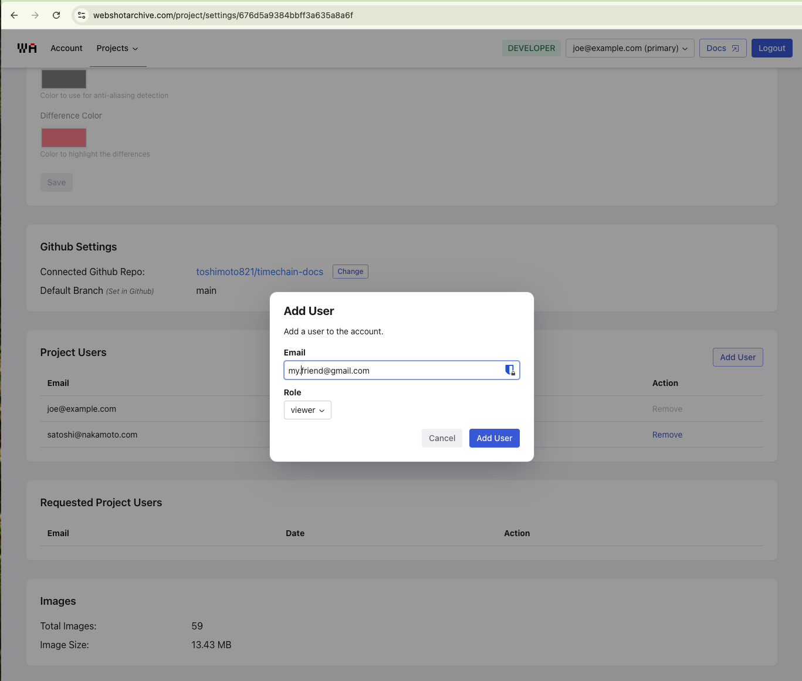
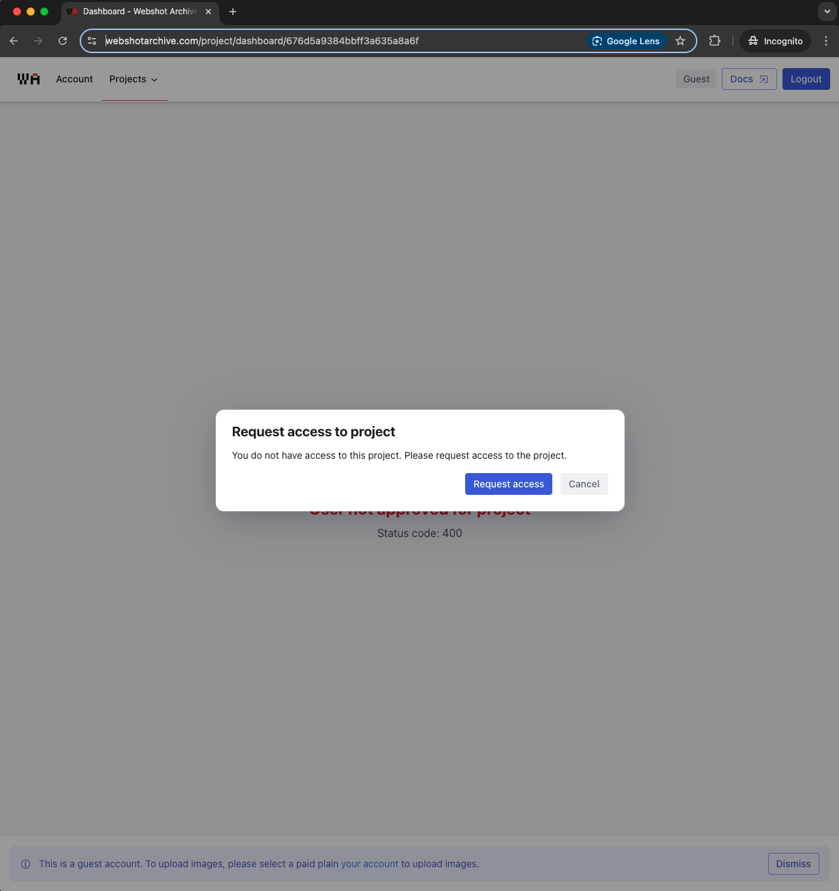
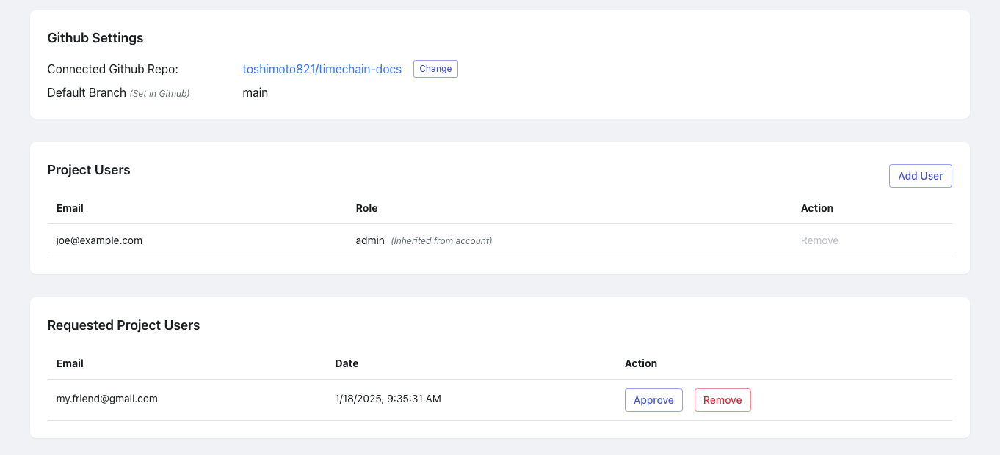

# How To Share Projects

One feature of Webshot Archive is the ability to share your projects with others.  
There are two primary ways to share a project:

<!-- truncate -->

1. A project admin adds a known user email to the project on the project settings page
   Clicking the `Add User` button on Project Settings page will display a dialog where you can enter an email address of a known user to add to the project.
   
2. Request access from the project dashboard. When you attempt to view a project you dont have access to (such as [this docs](https://www.webshotarchive.com/project/dashboard/676d5a9384bbff3a635a8a6f) project) you will be prompted to request access.
   
   Once requested, a project user (with admin access) can approve the request back in the project settings page.
   

This will provide user the new user view only access to the project. If you would like to provide the user full admin access, you can change the role on the project settings page after approving the request.
