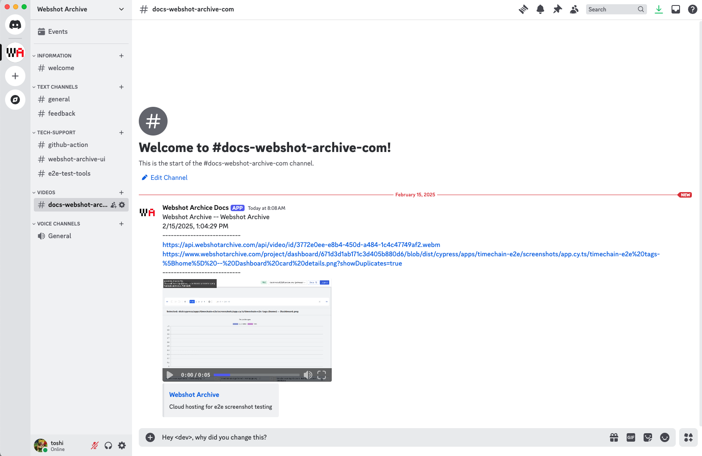
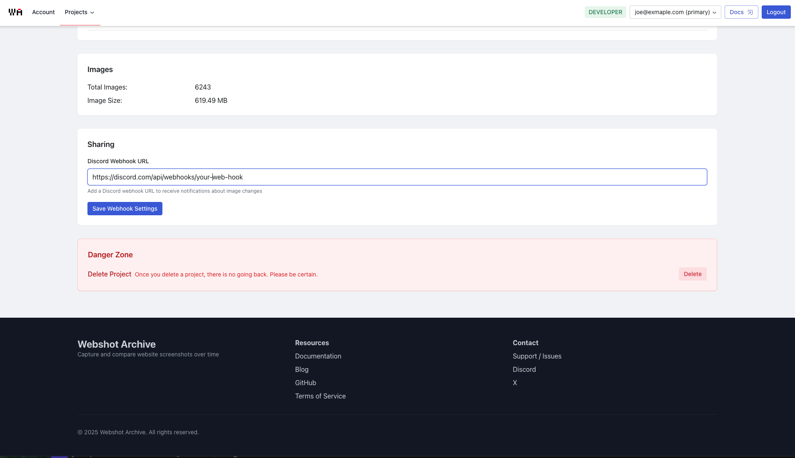
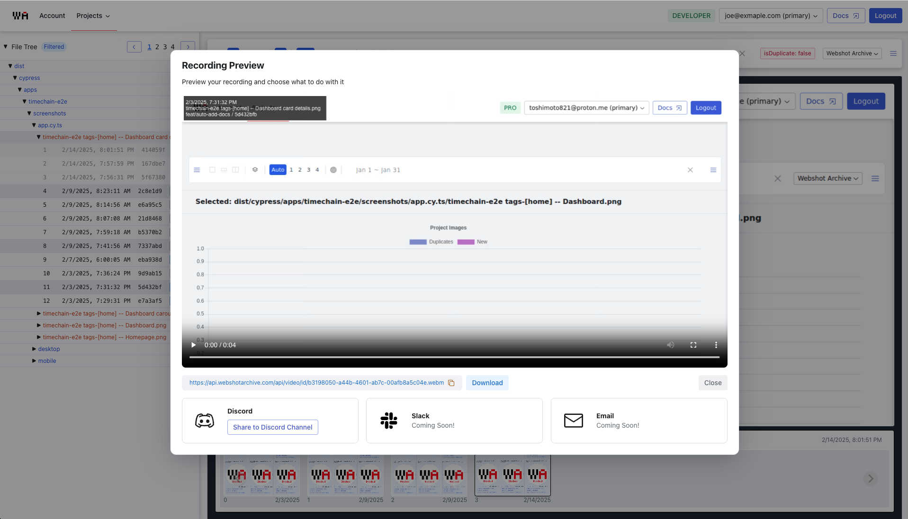

# Sharing to Discord, Slack, and more

New feature unlocked! You can now share your projects to Discord (Slack, and email coming soon).
Webshot Archive now supports integration with Discord via webhooks. What this means is that developers can now send clips of changes to your projects to Discord channel. This will help teams catch changes, bugs, and features earlier in the development cycle.

View the example in the [Webshot Archive Discord docs](https://discord.com/channels/1324501795556298763/1340134008293691474) channel.

<!-- truncate -->

## How to setup Discord integration

1. Create a new webhook in Discord (Discord docs [here](https://support.discord.com/hc/en-us/articles/228383668-Intro-to-Webhooks).
2. Copy the webhook URL.
3. Paste the webhook URL into the Webshot Archive project settings page.
4. Click on the `Save` button.

## How to use

After creating a clip, you can now click "Share to Discord" button on the clip details dialog.

This will send the clip to the discord channel you setup in the previous step.

View the example in the [Webshot Archive Discord docs](https://discord.com/channels/1324501795556298763/1340134008293691474) channel.
