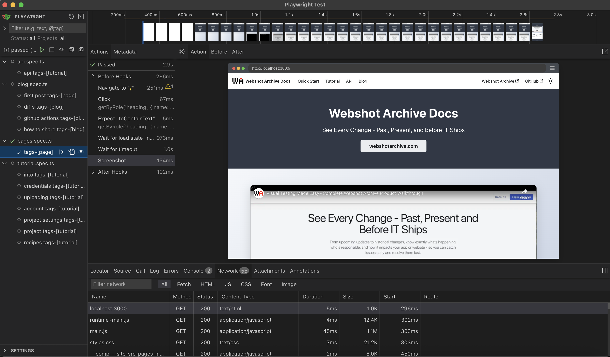

Playwright has rapidly become the go-to framework for modern web testing, and for good reason. While many developers know the basics, there are powerful features hiding beneath the surface that can dramatically improve your testing experience. Whether you're a seasoned tester or just getting started, these 10 features will take your Playwright skills to the next level.

From advanced debugging tools to seamless CI/CD integration, we're counting down the most game-changing features that every developer should know about.

<!--truncate-->

## #10: Test Reports and CI Integration

Playwright's reporting system provides comprehensive insights into your test execution, making it invaluable for both local development and CI/CD pipelines ([docs](https://playwright.dev/docs/running-tests#test-reports)).

The built-in HTML reporter offers rich visualizations including:

- Test execution timeline
- Screenshots and videos of failures
- Network request logs
- Console output capture

**CI Integration Made Easy:**

For GitHub Actions, you can preserve test artifacts with:

```yaml
- uses: actions/upload-artifact@v4
  if: always()
  with:
    name: playwright-report
    path: ./playwright-report/
    retention-days: 30
```

**Pro Tip:** Enable reports in your `playwright.config.ts` for automatic generation:

```ts
export default defineConfig({
  reporter: [
    ['html', { outputFolder: 'playwright-report' }],
    ['json', { outputFile: 'results.json' }],
  ],
});
```

## #9: Codegen - Automated Test Generation

Writing tests from scratch can be time-consuming. Playwright's codegen feature watches your browser interactions and generates test code automatically ([docs](https://playwright.dev/docs/codegen-intro#running-codegen)).

```bash
npx playwright codegen
```


**What makes it powerful:**

- **Language Support**: Generates code in JavaScript, TypeScript, Python, C#, or Java
- **Smart Selectors**: Creates robust locators that are less likely to break
- **Real-time Generation**: Watch code appear as you interact with the page
- **Custom URLs**: Start with `npx playwright codegen https://example.com`

**Best Practice:** Use codegen to bootstrap tests, then refine the generated code for better maintainability and add proper assertions.

## #8: Hosting Playwright Reports in the Cloud

Transform your test reports from local files into public, shareable dashboards using Azure Storage's static website hosting ([docs](https://playwright.dev/docs/ci-intro#publishing-report-on-the-web)).

**Azure Storage Static Website Setup:**

1. **Create Azure Storage Account** with static website hosting enabled
2. **Set up Service Principal** with Storage Blob Data Contributor access:

```bash
az ad sp create-for-rbac --name "github-actions" \
  --role "Storage Blob Data Contributor" \
  --scopes /subscriptions/<SUBSCRIPTION_ID>/resourceGroups/<RESOURCE_GROUP_NAME>/providers/Microsoft.Storage/storageAccounts/<STORAGE_ACCOUNT_NAME>
```

3. **Configure GitHub Secrets:**
   - `AZCOPY_SPA_APPLICATION_ID`
   - `AZCOPY_SPA_CLIENT_SECRET`
   - `AZCOPY_TENANT_ID`

4. **Add Upload Step to GitHub Actions:**

```yaml
- name: Upload HTML report to Azure
  shell: bash
  run: |
    REPORT_DIR='run-${{ github.run_id }}-${{ github.run_attempt }}'
    azcopy cp --recursive "./playwright-report/*" "https://<STORAGE_ACCOUNT_NAME>.blob.core.windows.net/\$web/$REPORT_DIR"
    echo "::notice title=HTML report url::https://<STORAGE_ACCOUNT_NAME>.z1.web.core.windows.net/$REPORT_DIR/index.html"
  env:
    AZCOPY_AUTO_LOGIN_TYPE: SPN
    AZCOPY_SPA_APPLICATION_ID: '${{ secrets.AZCOPY_SPA_APPLICATION_ID }}'
    AZCOPY_SPA_CLIENT_SECRET: '${{ secrets.AZCOPY_SPA_CLIENT_SECRET }}'
    AZCOPY_TENANT_ID: '${{ secrets.AZCOPY_TENANT_ID }}'
```

**Real-world Example:** Check out this [GitHub Action run](https://github.com/webshotarchive/docs/actions/runs/17671878545) that automatically deploys to this [hosted report](https://webshotarchiveplaywright.z13.web.core.windows.net/run-17671878545-1/index.html).

**Benefits:**

- Share results with stakeholders instantly
- Historical test trend analysis with unique URLs per run
- No local setup required for viewing reports
- Perfect for remote teams and CI/CD integration
- Cost-effective hosting solution

## #7: Advanced Debugging with Trace Viewer

When tests fail in CI but work locally, the Trace Viewer becomes your detective tool ([docs](https://playwright.dev/docs/trace-viewer)).

```bash
npx playwright show-trace path/to/trace.zip
```

**What you get:**

- **Complete Timeline**: Every action, assertion, and network request
- **DOM Snapshots**: See the exact page state at any point
- **Network Analysis**: Inspect requests, responses, and timing
- **Console Logs**: All browser console output captured
- **Screenshots**: Visual evidence of each step

**Enable tracing in your config:**

```ts
export default defineConfig({
  use: {
    trace: 'on-first-retry', // or 'retain-on-failure'
  },
});
```

**Pro Tip:** Use `trace: 'on'` during development and `trace: 'retain-on-failure'` in CI to balance performance with debugging capability.

## #6: VSCode Extension - IDE Integration

The official Playwright extension transforms VSCode into a powerful testing IDE ([docs](https://playwright.dev/docs/getting-started-vscode)).

**Key Features:**

- **Test Explorer**: Run individual tests or suites with one click
- **Interactive Debugging**: Set breakpoints and step through test code
- **Live Recording**: Record new tests directly in the editor
- **Pick Locator**: Click elements to generate selectors
- **Watch Mode**: Automatically re-run tests on file changes

**Installation:**

```bash
# Install from VSCode marketplace or
code --install-extension ms-playwright.playwright
```

**Why it's game-changing:** The seamless integration between test writing, debugging, and execution in a single environment dramatically speeds up development cycles.

## #5: Visual Regression Testing with toHaveScreenshot

Catch visual bugs before they reach production with Playwright's built-in screenshot comparison ([docs](https://playwright.dev/docs/api/class-pageassertions#page-assertions-to-have-screenshot-1)).

```ts
await expect(page).toHaveScreenshot('homepage.png');
```

**Advanced Options:**

```ts
await expect(page.locator('.hero-section')).toHaveScreenshot('hero.png', {
  threshold: 0.5, // 50% pixel difference tolerance
  maxDiffPixels: 100, // Maximum different pixels allowed
  animations: 'disabled', // Disable animations for consistent screenshots
});
```

**Best Practices:**

- Use `fullPage: true` for complete page captures
- Set consistent viewport sizes across environments
- Mask dynamic content like timestamps or user-specific data

:::tip
Checkout our [detailed blog post](https://docs.webshotarchive.com/blog/playwright-to-have-screenshot) comparing toHaveScreenshot() with advanced visual testing solutions
:::

## #4: Project Configuration for Multi-Environment Testing

Playwright projects allow you to run different test configurations simultaneously, perfect for testing across environments and browser configurations ([docs](https://playwright.dev/docs/test-projects)).

**Environment-Based Configuration:**

```ts title="playwright.config.ts"
import { defineConfig, devices } from '@playwright/test';

export default defineConfig({
  projects: [
    {
      name: 'staging',
      use: {
        baseURL: 'https://staging.example.com',
      },
      testMatch: /.*smoke.spec.ts/,
      retries: 2,
    },
    {
      name: 'local',
      use: {
        baseURL: 'http://localhost:3000',
      },
      testIgnore: /.*smoke.spec.ts/,
      retries: 0,
    },
  ],
});
```

**Setup Dependencies for Authentication:**

```ts title="playwright.config.ts"
export default defineConfig({
  projects: [
    {
      name: 'setup',
      testMatch: '**/*.setup.ts',
    },
    {
      name: 'chromium',
      use: { ...devices['Desktop Chrome'] },
      dependencies: ['setup'],
    },
    {
      name: 'firefox',
      use: { ...devices['Desktop Firefox'] },
      dependencies: ['setup'],
    },
  ],
});
```

**Run specific projects:**

```bash
npx playwright test --project=staging
```

## #3: Authentication and Session State Management

Eliminate repetitive login steps and speed up test execution with Playwright's authentication state management ([docs](https://playwright.dev/docs/auth)).

**Setup Authentication Once:**

```ts title="tests/auth.setup.ts"
import { test as setup, expect } from '@playwright/test';
import path from 'path';

const authFile = path.join(__dirname, '../playwright/.auth/user.json');

setup('authenticate', async ({ page }) => {
  await page.goto('https://github.com/login');
  await page.getByLabel('Username or email address').fill('username');
  await page.getByLabel('Password').fill('password');
  await page.getByRole('button', { name: 'Sign in' }).click();

  await page.waitForURL('https://github.com/');
  await expect(
    page.getByRole('button', { name: 'View profile and more' })
  ).toBeVisible();

  // Save authentication state
  await page.context().storageState({ path: authFile });
});
```

**Use Saved State in Tests:**

```ts title="playwright.config.ts"
export default defineConfig({
  projects: [
    { name: 'setup', testMatch: /.*\.setup\.ts/ },
    {
      name: 'chromium',
      use: {
        ...devices['Desktop Chrome'],
        storageState: 'playwright/.auth/user.json',
      },
      dependencies: ['setup'],
    },
  ],
});
```

**Benefits:**

- Run authentication once, use across all tests
- Dramatically faster test execution
- Consistent authentication state
- Support for multiple user roles

## #2: Test Sharding for Massive Performance Gains

When you have hundreds or thousands of tests, sharding distributes them across multiple machines for parallel execution ([docs](https://playwright.dev/docs/test-sharding)).

**Local Sharding:**

```bash
# Split tests across 4 processes
npx playwright test --shard=1/4 &
npx playwright test --shard=2/4 &
npx playwright test --shard=3/4 &
npx playwright test --shard=4/4 &
```

**GitHub Actions Matrix:**

```yaml
strategy:
  matrix:
    shard: [1/4, 2/4, 3/4, 4/4]
steps:
  - name: Run Playwright tests
    run: npx playwright test --shard=${{ matrix.shard }}
```

**Performance Impact:**

- **4x faster** test execution with 4 shards
- Linear scaling with more machines
- Automatic test distribution
- Perfect for large test suites in CI

**Best Practice:** Use sharding when your test suite takes more than 10-15 minutes to run sequentially.

## #1: UI Mode - The Ultimate Testing Experience

Playwright's UI Mode is a revolutionary testing interface that transforms how you develop, debug, and maintain tests ([docs](https://playwright.dev/docs/test-ui-mode)).

```bash
npx playwright test --ui
```



**Why it's #1:**

**🎯 Interactive Test Development**

- Watch tests execute in real-time
- Pick locators visually
- Time-travel through test execution
- Edit and re-run tests instantly

**🔍 Advanced Debugging**

- Set breakpoints in test code
- Inspect DOM at any step
- View network requests and responses
- Analyze performance metrics

**📊 Comprehensive Test Management**

- Filter tests by status, project, or tags
- Run tests individually or in groups
- View detailed execution timelines
- Export traces for offline analysis

**🚀 Live Development**

- Hot reload test changes
- Real-time code generation
- Interactive element inspection
- Instant feedback loop

**Enterprise Features:**

- Team collaboration with shared traces
- Historical test run analysis
- Integration with popular CI/CD tools
- Extensible with custom reporters

**Getting Started:**

```bash
# Launch UI Mode
npx playwright test --ui

# Open specific test file
npx playwright test --ui tests/example.spec.ts

# Debug mode with UI
npx playwright test --ui --debug
```

UI Mode represents the future of testing tools—combining the power of automation with the intuition of visual interfaces. It's not just a feature; it's a complete paradigm shift that makes testing accessible, efficient, and dare we say... enjoyable.

---

## Conclusion

These 10 features showcase why Playwright has become the testing framework of choice for modern web development. From the revolutionary UI Mode that transforms your testing workflow to powerful CI integrations that scale with your team, each feature solves real problems that developers face daily.

**Ready to level up your testing game?** Start with UI Mode and authentication setup—these two features alone will dramatically improve your testing experience. Then gradually incorporate the others as your testing needs grow.

The future of web testing is here, and it's more powerful and accessible than ever before.
