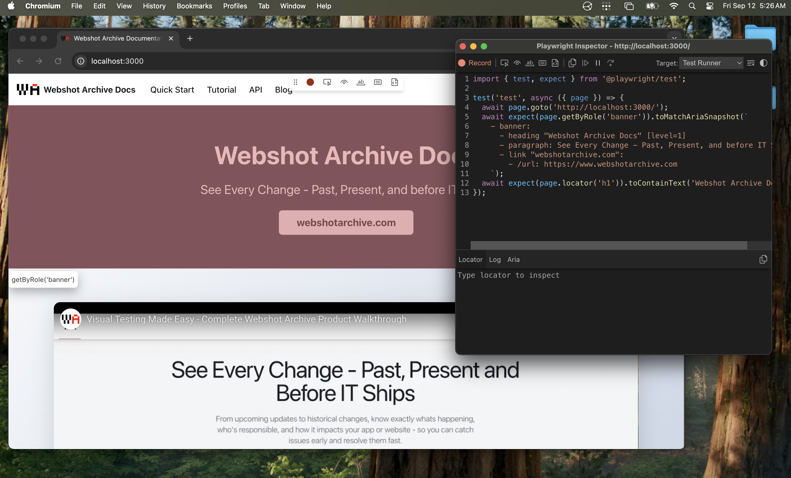

This is the summary of a very long blog post,

Use a `<!--` `truncate` `-->` comment to limit blog post size in the list view.

## Codegen

Use the `codegen` is a command to generate tests for you or to help get started ([docs](https://playwright.dev/docs/codegen-intro#running-codegendocs)).

```bash
npx playwright codegen
```



## Debugging tests

Debugging tests is an essential skill in writing tests ([docs](https://playwright.dev/docs/running-tests#debugging-tests)).

```bash
npx playwright test --debug
```

Additionally you can pause a test using `await page.pause()`.

## Test Reports

Test reports give you a breakdown of how your test results. ([docs](https://playwright.dev/docs/running-tests#test-reports)).

You can upload your playwright report during CI on Github Actions using:

```yaml
- uses: actions/upload-artifact@v4
  if: always()
  with:
    name: playwright-report
    path: ./path/to/playwright-report/
    retention-days: 30
```

## Trace Viewer

Failed test can be analzyed locally using the trace viewer ([docs](https://playwright.dev/docs/trace-viewer))

```bash
npx playwright show-trace path/to/trace.zip
```

## Hosting Playwright Reports

Utilize Azure static web hosting and publish reports to a storage bucket ([docs](https://playwright.dev/docs/ci-intro#publishing-report-on-the-web))
