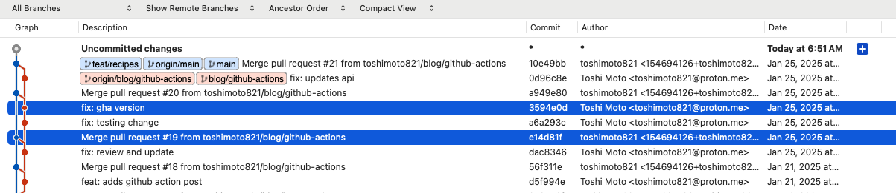
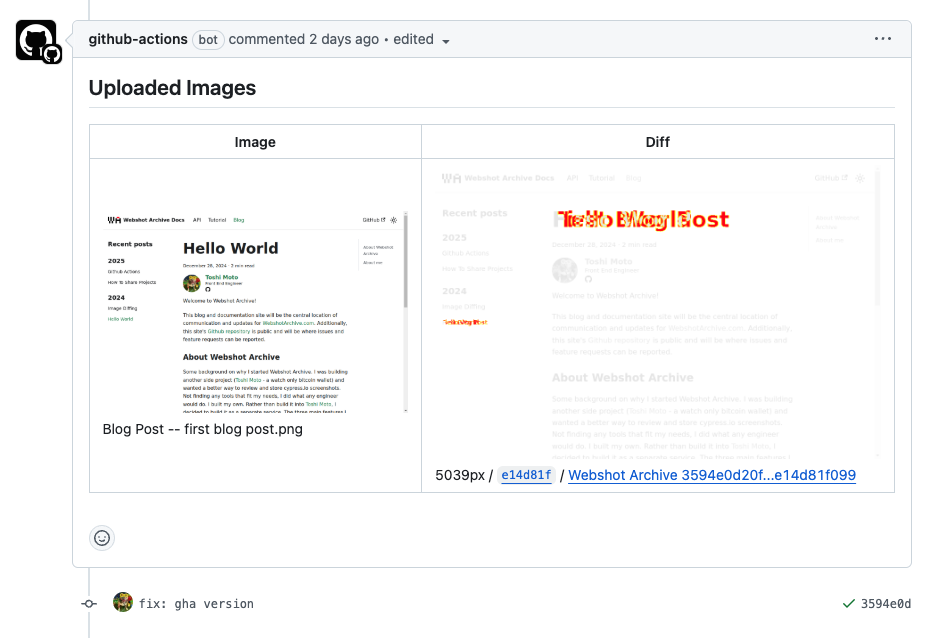
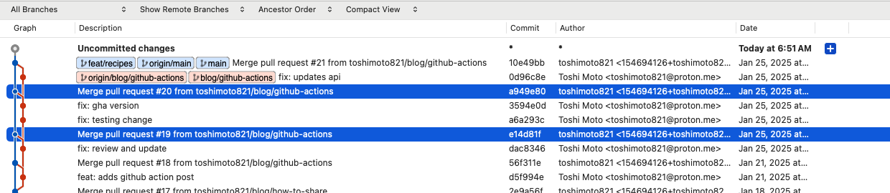

# Github Action: Push & Pull

This recipe contains two actions, one runs on `pull_request:` and the other runs on `push:`. The result is that it generates a comment on a pull request (like [this](https://github.com/webshotarchive/docs/pull/20#issuecomment-2613963591)) and stores the screenshots when the PR is merged into main.

## Running on `pull_request:`

The Pull Request had two commits and each triggered the workflow and created/updated the comment with images that had diffs (and only images that had diffs).


The `pull_request` event is triggered and the comparision is done between the `github.event.pull_request.base.sha` of the pull request (`e14d81f` was the HEAD of the base branch that the pull request was being merged into)
and the head of the branch on the PR (`3594e0d` was the HEAD of the branch that the pull request was being merged into).
[Here](https://github.com/webshotarchive/docs/pull/20) is the link to the pull request that was opened, changing the title of the first blog post.



From the Webshot Archive Githhub Action logs you can see the head commit sha and base commit sha:

```text title="Github Action Logs: Action Logs: PR #20 (commit 2 -3594e0d)"
head commit sha: 3594e0d20f0d96512aef5f4ac9745fb5b2404fc5
base commit sha: e14d81f099260e4c0f8063056d65c990bffed14a
```

([link](https://github.com/webshotarchive/docs/actions/runs/12965291842/job/36164870327#step:7:66) to workflow run)

```text title="Github Action Logs: PR #20 (commit 1 - a6a293c)"
head commit sha: a6a293c031e6d0059d3167f1d6173ed2b61c4300
base commit sha: e14d81f099260e4c0f8063056d65c990bffed14a
```

([link](https://github.com/webshotarchive/docs/actions/runs/12965279669/job/36164847197#step:7:66) to workflow run)

As shown above the comment on the PR generates a diff of the images that have changed on the right (changes in red) and the image new image on the left.

The complete Github Action for the `pull_request:` is shown below:

```yaml title="Github Action: Pull Request Screenshots" showLineNumbers
name: Pull Request Screenshots

on:
  pull_request:

permissions:
  actions: read
  contents: read
  issues: write
  pull-requests: write

jobs:
  main:
    runs-on: ubuntu-latest
    steps:
      - uses: actions/checkout@v4
        with:
          fetch-depth: 0

      # Cache node_modules
      - uses: actions/setup-node@v4
        with:
          node-version: 20

      - name: Install dependencies using pnpm
        run: npm ci

      - name: Build
        run: npm run build

      - name: Screenshots
        run: npm run cypress:e2e
        continue-on-error: true
        id: screenshots

      - name: WebshotArchive Action
        uses: webshotarchive/github-action@v1.1.1
        with:
          screenshotsFolder: dist/cypress
          clientId: ${{ secrets.CLIENT_ID }}
          clientSecret: ${{ secrets.CLIENT_SECRET }}
          projectId: ${{secrets.PROJECT_ID}}

      - name: Check if screenshots failed
        if: steps.screenshots.outcome == 'failure'
        run: exit 1
```

## Running on `push:`

When the merge occurs the Github Action is triggered again from the push event and the comparision is made against the previous commit on the main branch:



```text title="Github Action Logs: merge (commit 1 - a949e80)"
head commit sha: 10e49bb4c241d1decd88958ab9fd3dc49910eba2
base commit sha: a949e803b395a76abfce6638410de6df2e152cf5
```

([Link](https://github.com/webshotarchive/docs/actions/runs/12965499254/job/36165297766#step:7:54) to workflow run)

Although the changes are the exact same as the pull request, the images are generated again on `main` to ensure that the `main` branch always has the latest UI snapshot and keeps a record of images on `main` for future comparisons.

The action is similar to the pull_request and could even be combined into a single workflow if you like:

```yaml title="Github Action: Push Screenshots" showLineNumbers
name: Main Branch Screenshots

on:
  push:
    branches:
      - main

permissions:
  actions: read
  contents: read
  issues: write
  pull-requests: write

jobs:
  main:
    runs-on: ubuntu-latest
    steps:
      - uses: actions/checkout@v4
        with:
          fetch-depth: 0

      # Cache node_modules
      - uses: actions/setup-node@v4
        with:
          node-version: 20

      - name: Install dependencies using pnpm
        run: npm ci

      - name: Build
        run: npm run build

      - name: Screenshots
        run: npm run cypress:e2e
        continue-on-error: true
        id: screenshots

      - name: WebshotArchive Action
        uses: webshotarchive/github-action@v0.1.0
        env:
          GITHUB_TOKEN: ${{ secrets.GITHUB_TOKEN }}
        with:
          screenshotsFolder: dist/cypress
          clientId: ${{ secrets.CLIENT_ID }}
          clientSecret: ${{ secrets.CLIENT_SECRET }}
          projectId: ${{secrets.PROJECT_ID}}

      - name: Check if screenshots failed
        if: steps.screenshots.outcome == 'failure'
        run: exit 1
```
